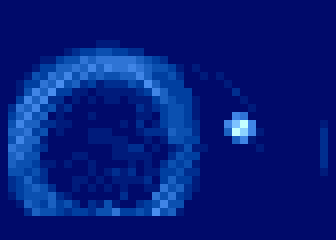
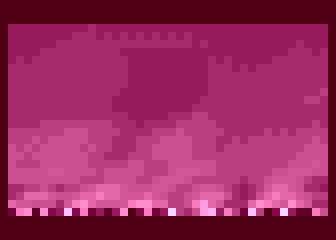

# Shades of Summer

This is my entry for Silly Venture 2025, summer edition. It took 3rd place in the 256-byte intro compo for Atari XE/XL. This repository contains the complete source code with extensive comments.

The intro features two effects: “water” and “fire.” Both run in character mode, with the GTIA switched to a mode capable of displaying 16 shades of a single color. The screen resolution is 40×25 pixels.

 &nbsp;&nbsp;&nbsp; &nbsp; 
